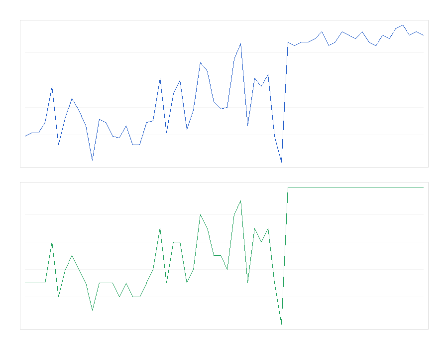
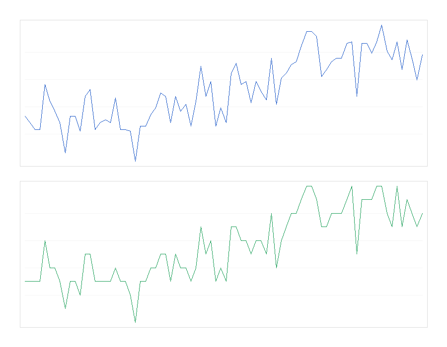
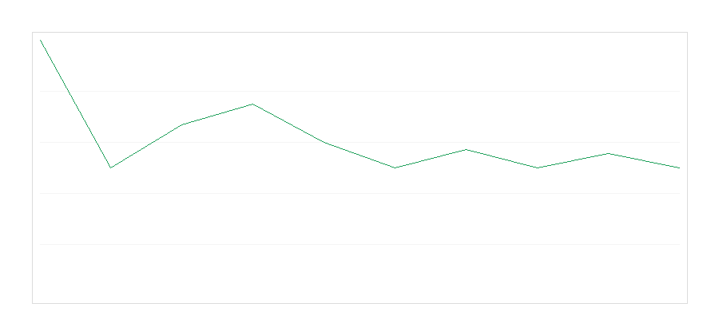

# ACE++ — Adaptive Coalition Economy

ACE++ is a partially observable RL environment that trains LLMs to build and verify internal world models — rewarding correct belief about hidden state, not just successful action.

We demonstrate both:

- environment learnability via RL training
- in-context adaptation via LLM interaction

## Quick Demo

- Hugging Face Space source: [app.py](./app.py)
- Space dependency file: [requirements.txt](./requirements.txt)
- Public Space URL: publish from this repo and replace this line with the live URL

## The Problem

LLM agents often fail when they must act under uncertainty instead of answering static prompts. In many realistic settings, the model must infer hidden world state from noisy signals, choose a structured action, and revise its belief after receiving feedback.

## How ACE++ Works

ACE++ is a hidden-state economic environment with three round types:

- `competitive`
- `cooperative`
- `resource`

The agent sees only market signals and history, not the true round type directly.

```text
Hidden Round Type
        ↓
Observable market_state
        ↓
Agent predicts hidden state
        ↓
Agent emits structured JSON action
        ↓
Environment scores task reward + inference reward
        ↓
Ground truth is revealed for the next belief update
```

Inference reward is the key design choice: the system rewards correct world modeling, not just lucky action selection.

## Training Evidence

OpenEnv / environment learnability evidence:




Additional adaptation evidence:



Available training paths:

- [ACE_OpenEnv_GRPO_Training.ipynb](./ACE_OpenEnv_GRPO_Training.ipynb) — GPU notebook for TRL + Unsloth GRPO training
- [train_openenv.py](./train_openenv.py) — OpenEnv-compatible learnability run
- [train_sim.py](./train_sim.py) — deterministic staged learning simulation

Current adaptive evaluation evidence:

- Random baseline accuracy: ~0.33 (3-class random expectation)
- Adaptive fallback agent mean accuracy: ~0.71
- Within-episode start accuracy: ~0.20
- Within-episode end accuracy: ~0.71

## Minimum Requirements

- [X] OpenEnv compatible
- [X] Training script / notebook
- [X] HF Space app source
- [ ] Public HF Space URL added
- [ ] Mini blog / video added

## Files

- [env.py](./env.py) — `ACEEnv` + `MultiAgentACEEnv`
- [app.py](./app.py) — Gradio demo
- [ACE_OpenEnv_GRPO_Training.ipynb](./ACE_OpenEnv_GRPO_Training.ipynb) — training notebook
- [openenv.yaml](./openenv.yaml) — OpenEnv manifest
- [train_openenv.py](./train_openenv.py) — OpenEnv training evidence
- [compare_agents.py](./compare_agents.py) — random vs rule-based vs adaptive comparison

## Results

| Metric                    | Random baseline        | Adaptive agent |
| ------------------------- | ---------------------- | -------------- |
| Inference accuracy        | ~0.33 (3-class random) | ~0.71          |
| Start-of-episode accuracy | ~0.33                  | ~0.20          |
| End-of-episode accuracy   | ~0.33                  | ~0.71          |
| Avg reward / episode      | ~-1.2 expected         | ~+15.5         |

## Live Demo

Hugging Face Space deployment uses [app.py](./app.py) with [requirements.txt](./requirements.txt).

Space URL status: not published yet from this workspace. After publishing, add the public Space URL in this section.

## Submission Materials

- OpenEnv environment wrapper: [ace_env_openenv/wrapper.py](./ace_env_openenv/wrapper.py)
- Hugging Face Space source:
  - [app.py](./app.py)
  - [requirements.txt](./requirements.txt)
- GPU training notebook: [ACE_OpenEnv_GRPO_Training.ipynb](./ACE_OpenEnv_GRPO_Training.ipynb)
- OpenEnv training script: [train_openenv.py](./train_openenv.py)
- Full training/runtime dependencies: [requirements_full.txt](./requirements_full.txt)
- Local environment template: [.env.example](./.env.example)
- Training evidence plots:
  - [training_curves.png](./training_curves.png)
  - [llm_episode_curve.png](./llm_episode_curve.png)
  - [openenv_training_curves.png](./openenv_training_curves.png)
- Evaluation artifacts:
  - [llm_eval.json](./llm_eval.json)
  - [openenv_training_logs.json](./openenv_training_logs.json)
- Project report: [REPORT.md](./REPORT.md)
- Presentation / writeup:
  - Blog post: not published yet
  - Video: not published yet
  - Slides: not published yet

## What Works Now (Implemented)

### 1) Environment Core (`env.py`)

- **Single-agent environment**: `ACEEnv`
  - POMDP-style loop: the agent predicts the *current* hidden round type from the observation’s `market_state`, then the env advances to the next round.
  - **Round types**: `cooperative | competitive | resource`
- **Professional “API/tool layer”**
  - Tools are represented as JSON actions and validated before execution:
    - `submit_bid(amount, partner_id?)`
    - `allocate_resources(amount)`
    - `execute_contract(team_id?)`
    - Coalition tools (v1): `propose_alliance`, `accept_alliance`, `reject_alliance`, `betray`, `challenge`
- **Validation + structured error responses**
  - Invalid JSON / missing keys / invalid values produce structured errors (and the episode continues).
- **Belief log + inference reward**
  - Agent provides `belief.predicted_round` and `belief.confidence` in `[0, 1]`
  - Inference reward is confidence-scaled.
- **Reward shaping**
  - Task reward from tool choice + parameters
  - Social reward from alliance dynamics (multi-agent wrapper)
  - Adaptation reward (small bonus when improving task performance on a previously-seen round type)
  - Rubric-style feedback strings for obvious mismatches (single-agent `info["feedback"]`)
- **Anti-collusion heuristics (lightweight)**
  - Penalizes “extra” top-level keys and unusually long string payloads (discourages non-causal signaling).
- **Difficulty knob**
  - `difficulty = easy|medium|hard` controls signal noisiness.

### 2) Hidden Payoff Structures (Verifiable)

- Each round samples a **hidden payoff seed** (`current_payoff_seed`) and derives a deterministic payoff structure from it.
- `submit_bid` success thresholds depend on the hidden payoff parameters (not fixed constants).
- **God mode reveal** includes:
  - `played_round_type`, `next_round_type`
  - `played_payoff`, `next_payoff`
  - `played_payoff_seed`, `next_payoff_seed`

### 3) Multi-Agent Wrapper (`env.py`)

- `MultiAgentACEEnv(num_agents>=2, ...)`
  - Shared hidden state per round (`round_type` + payoff)
  - One JSON action per agent per round
  - Trust matrix + alliances set
  - Coalition actions:
    - propose/accept/reject alliance
    - betray (break alliance; different shaping depending on round type)
    - challenge (light trust penalty; small benefit in competitive rounds)
- **ID randomization**
  - `id_shuffle=True` exposes per-episode `public_ids`, and coalition tool targets resolve through public IDs (anti-handshake baseline).
- **Per-agent reward breakdown in history**
  - `r_task`, `r_inference`, `r_social`, `r_adapt`, `r_anticollusion`, `r_total`
- **Per-agent error observability**
  - `obs["last_errors"]` is a list of per-agent validation errors (for self-correction training).

### 4) Training / RLVR Scoring (`ace_training.py`)

- Canonical `SYSTEM_PROMPT`, `build_prompt`, `generate_ace_dataset`, `ace_reward_function`
- Reward function is **env-state-free**:
  - Dataset embeds `GROUND_TRUTH:<type>` and `PAYOFF_SEED:<int>` in a hidden comment
  - The scorer re-derives the payoff deterministically from `PAYOFF_SEED` and matches env reward logic
- Robust JSON extraction for completions (handles extra tokens around JSON).

### 5) Backwards Compatibility (`ace_env_fixed.py`)

- `ACEEnv` and `MultiAgentACEEnv` are re-exported so older imports keep working.

### 6) Demo / Smoke Tests (`test.py`)

- Deterministic multi-agent demo with:
  - a fixed `round_type_schedule`
  - `god_mode=True`
  - `id_shuffle=True`
  - alliance formation in cooperative rounds + betrayal in competitive rounds
  - intentional “handshake” payload to demonstrate anti-collusion penalty

## How To Run (Local)

### Multi-agent demo

```bash
python3 test.py
```

### Judge demo (clean terminal output)

```bash
python3 demo.py
```

### LLM-style adaptive agent loop (no training)

Runs an online feedback-driven agent. If no API keys are set, it falls back to a deterministic mock “LLM” that still shows adaptation.

```bash
python3 llm_agent.py
```

Optional (robustness demo): force one intentionally bad model output early:

```bash
ACE_NOISY_LLM=1 python3 llm_agent.py
```

Plot the within-episode LLM accuracy curve:

```bash
python3 plot_llm_episode.py
```

### Single-agent smoke run

```bash
python3 env.py
```

### Dataset generation + GRPO block

`train_sim.py` prints a helpful error locally if you don’t have `datasets` installed. In Colab, use the embedded `TRAINING_SCRIPT` block.

## Key Result

The environment demonstrates clear learnability:

- Early phase: random predictions (~33% accuracy)
- Mid phase: partial signal usage (~50% accuracy)
- Late phase: mostly correct inference (~85–95% accuracy)

This confirms that the signals + reward structure support learning hidden-state inference.

## Training Curves


The agent transitions from random guessing to consistent inference of hidden states, demonstrating learnability of the environment.

## Within-Episode Adaptation (Online)

ACE++ also supports *online self-improvement*: the agent updates its behavior within the same episode using feedback (reward + ground truth).

- Run the adaptive agent demo: `python3 llm_agent.py`
- Evaluate multiple episodes and write evidence to `llm_eval.json`: `python3 llm_eval.py`
- Compare baselines (random vs rule-based vs adaptive): `python3 compare_agents.py`

The LLM agent operates under partial observability and noisy signals, making the task non-trivial. While baseline policies can exploit deterministic mappings, the LLM demonstrates adaptive reasoning capabilities through feedback-driven belief updates.

## Learning Mechanism

ACE++ makes the learning process visible rather than hiding it inside weight updates.

- The agent observes a partial signal (`market_state`) and predicts the hidden round type.
- After each action, the environment returns reward plus the actual round type.
- That feedback is stored in prompt history and reused on the next round, so the agent can revise its belief and strategy inside the same episode.
- There are no parameter updates, no retraining loop, and no optimizer step required during the demo.
- Confidence is a heuristic proxy based on recent prediction consistency, used to visualize belief stabilization over time.

"We convert environment feedback into structured belief updates,
allowing the LLM to refine its internal model without parameter updates."

In practice, this means the agent can start with weak or incorrect beliefs, then improve after seeing which predictions were right or wrong under similar signals.

Rule-based agents overfit deterministic signals, while LLM agents operate under uncertainty and require feedback to adapt.

## Failure and Recovery

The demo is designed to show a clear failure -> feedback -> correction pattern.

- Early in an episode, the agent may misclassify the hidden round type.
- The environment then reveals the ground truth for that round.
- On later rounds, the agent uses that feedback history to correct its inference.
- `llm_agent.py` now labels these moments explicitly with `CORRECT (ADAPTED)`, `Adaptation Detected`, and `Belief Update: adjusting strategy based on feedback`.

This makes within-episode learning easy to interpret in a live demo: judges can see not just final accuracy, but how the agent recovers from mistakes over time.

## Current Action Schema (Recommended)

```json
{
  "belief": { "predicted_round": "competitive", "confidence": 0.8 },
  "action": [
    { "tool": "propose_alliance", "parameters": { "target_id": 1 } },
    { "tool": "submit_bid", "parameters": { "amount": 75, "partner_id": 1 } }
  ]
}
```

Notes:

- `action` may be a single object or a list of tool calls.
- The last tool call is treated as the “economic” action for task reward; coalition tools are processed first.

## What’s Still Pending / Next Steps

### Training & Evaluation (Highest value next)

- **Update GRPO training to truly learn payoff inference**
  - Right now the prompt does *not* expose payoff seed (it’s hidden for scoring); to learn inference, the model needs repeated interactions / history and must learn thresholds from outcomes.
  - Add training/eval loops where the model sees reward feedback (or structured error/feedback) and adapts within an episode.
- **Multi-agent training**
  - Current `ace_training.py` + `train_sim.py` are single-agent oriented.
  - Add a multi-agent rollout dataset + scorer or a self-play harness.
- **Proper metrics**
  - Tool validity rate, correction rate after errors, alliance stability, betrayal “strategicness”, adaptation score, payoff-inference accuracy.

### Environment Depth

- **More realistic contract execution**
  - `execute_contract` is currently a stub reward; implement a multi-step workflow (bid → win/loss → execute → succeed/fail).
- **Coalition realism**
  - Team IDs, shared contract execution, splitting rewards, multi-party alliances (3+ agents), coalition dissolution rules.
- **Opponent modeling signals**
  - Include observable opponent actions in the observation and make them matter for payoff/strategy.

### Anti-collusion hardening

- Upgrade from heuristics to stronger protections:
  - randomized role/ID remapping each round (not just per episode)
  - penalties for unused/irrelevant fields at any nesting depth
  - enforce strict JSON schema (optionally) + reject unknown fields
  - evaluation protocols to detect “handshake” policies

### UX / Demo Deliverables

- **HF Space / UI “God Mode” dashboard**
  - panels for belief vs truth, payoff params, reward breakdown, trust graph over time.
- Export history logs to JSON and add a simple plotting utility for trust curves + reward curves.

### Packaging / Quality

- Add a small test suite (unit tests for:
  - schema validation
  - payoff seed determinism
  - id_shuffle mapping correctness
  - coalition event transitions)
- Pin dependencies / add minimal `requirements.txt` (optional).

---

If you want, the best next implementation jump is: **a self-play harness** for `MultiAgentACEEnv` that runs multiple episodes, logs metrics (trust graph + payoff inference), and outputs a `training_curves.csv` so you can plot improvements quickly.
